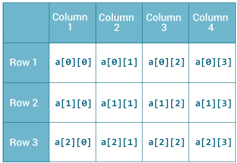

# Cheat Sheet Java
## Structure d'un programme Java
### Méthode Main
```Java
static void Main(String args[]){
    //Ici on peut écrire du code qui sera executé
}
```
## Bases de l'algorithmie
### Variables
Une variable est une case mémoire qui peut contenir une donnée.
En Java, cette donnée est dite “fortement typée”, c’est à dire qu’une fois que l’on a définit son type, elle ne peut changer.
Voici une liste (non exhaustive) des types les plus couramment utilisés :
* Les entiers : int (avec des déclinaisons : byte, short, long)
* Les décimaux : double
* Les flottants : float (nombre à virgule flottante, c’est compliqué..)
* Les caractères : char
* Les chaînes de caractères : String
* ...

Pour déclarer (créer) une variable, il faut donc spécifier son type, mais aussi son nom.
```Java
int variable; // Variable de type int qui s'appelle variable
```
Pour instancier (donner une valeur) à une variable, on peut le faire à 2 moments différents : au moment de la création de la variable, après la création de la variable.
```Java
int variable = 5; // Instanciation et déclaration en même temps
int variable;
var = 5; // Instanciation après la déclaration
```
Il est important de retenir qu’une variable qui n’a pas de valeur n’est pas utilisable. Par exemple : 
```Java
int variable;
System.out.println(var); // Cette ligne renvoie une erreur car la variable n'a pas été initialisée.
```
### Opérations sur les variables de base
#### Nombres (Entiers, Décimaux)
On peut effectuer les opérations de base sur les nombres :
* Addition / Soustraction
```Java
int x = 5+6; // Equivalent à x = 11
int y = 41 - 3; // Equivalent à y = 38
int z = x + y; // Equivalent à z = 11 + 38
int z = z + z // Equivalent à z = 49 + 49. On note ici l'utilisation de la même variable à gauche et à droite de l'égalité. C'est tout à faire possible et c'est même souvent utilisé ! En effet, on "met à jour" la variable z en utilisant son ancienne valeur.
```

* Multiplication / Division
```Java
int a = 3 * 4; // a contient 12.
int x = 4/5; // On s'attend à avoir un résultat à virgule, non ? Attention ! int ne peut contenir que des nombres entiers. Une division avec des nombres entiers correspond à une division euclidienne dont on récupère le quotient. Ici x contient donc 0.
double y = 4/5; //Bon cette fois on a ce qu'on veut.. NON ?! Attention ! Double peut contenir des nombres à virgule, mais l'opération (4/5) ne contient que des nombres entiers. y contient donc 0.
double z = 4.0/5.0; //Cette fois c'est la bonne ! 4.0 et 5.0 sont des doubles et la division est donc juste. z contient 0.8.
```
* Modulo
La division de nombre entiers nous donne le quotient mais il y a des fois, pour des raisons algorithmiques, on souhaite récupérer le reste de cette division.
```Java
int a = 5%4; // a contient 1.
int b = 10%2 // b contient 0.
```
#### Chaînes de caractères
```Java
String a = "Kono DIO da !";
System.out.print.ln(a); // Imprime Kono DIO da ! dans la console.
String b = "Yare Yare Daze.";
String c = a + " " + b; // c contient Kono DIO da ! Yare Yare Daze.
```
#### Affichage
On l'a vu plusieurs fois avant mais je le rappelle ici 
```Java
System.out.print("Truc à afficher"); // Sans saut de ligne à la fin
System.out.print.ln("Truc à afficher"); // Avec saut de ligne à la fin
```
### Structure de contrôle
En algorithmie, on a souvent besoin de faire des choix dépendants des valeurs de nos variables.
```Java
int a = 4; // On définit une variable a qui contient 4
if (a % 2 == 0){ // SI le reste de la division euclidienne de a par 2 est égal à 0
    // On execute le code ici
    a = a/2;
} else {
    // Sinon on execute le code ici
    a = 2*a;
}
```
On peut imposer différentes conditions sur nos expressions :
* Les valeurs sont elles égales ? a == b
* La première valeur est elle inférieure à la deuxième valeur ? a < b
* La première valeur est elle inférieure ou égale à la deuxième valeur ? a <= b
* La première valeur est elle supérieure à la deuxième valeur ? a > b
* La première valeur est elle supérieure ou égale à la deuxième valeur ? a >= b

Ces différentes conditions sont en réalité des expressions booléennes que l'on peut combiner.
Je vous met ici un tableau qui récapitule les différentes combinaisons possibles.

0 veut dire faux et 1 veut dire vrai
* "+" veut dire "ou" et en Java on écrit "||"
* "." veut dire "et" et en Java on écrit "&&"
* "-" au dessus veut dire "non" et en Java on écrit "!" devant la proposition

### Boucles
Lorsque l'on veut répeter plusieurs fois la même instruction, on utilise des boucles.
#### While
While ("tant que" dans la langue de Molière) est utile lorsque l'on ne sait pas exactement combien de fois on veut repeter l'action, mais que l'on connait la condition d'arrêt de la boucle.
```Java
int a = 4;
boolean fini = false;
while(fini == false){ // Tant que le booleen fini vaut false
    a = a/2;
    if(a == 1){
        fini = true; // On change la valeur du booléen fini pour invalider la condition de la boucle et donc en sortir
    }
}
```
#### For
For ("pour") est utile lorsque l'on sait combien de fois on veut repeter l'action
```Java
int a = 0;
for(int i = 1; i <= 10; i++){ // On initialise i à 1 et s'il est inférieur ou égal à 10 alors on éxécute le code entre {} puis i est incrémenté
    a = a+i;
}
```
## Tableaux
Afin de conserver des données qui ont un certain lien entre elles, on peut utiliser une structure de données qu'on appelle tableau. Les tableaux contiennent des données d'un seul et même type (que ce soit un type primitif ou une classe). Les tableaux sont dits statiques : leur taille doit être définie à la création du tableau.

Dans la suite j'utiliserai des tableaux d'entiers (car c'est le type de tableaux le plus courant en 1A) mais gardez à l'esprit qu'un tableau peut contenir autre chose que des entiers.

### Tableaux 1D
Un tableau à une dimension est une ligne.

#### Créer un tableau 1D
Afin de créer un tableau 1D, nous avons plusieurs solutions :
```Java
// On définit ce qu'il y a dans le tableau
// La taille est calculée en fonction des donneés, ici les tableaux ont une taille de 4 car il y a 4 valeurs.
int[] a = {0, 1, 2, 3};
int a[] = {0, 1, 2, 3};

// On créé un tableau vide de taille définie
int[] a = new int[4];
int a[] = new int[4];
```
#### Acceder aux données d'un tableau 1D
Pour accéder aux données, il faut fournir la position de la donnée à laquelle on veut accéder :
```Java
int[] a = {0, 1, 2, 3};
int b = a[0]; //Attention : Les tableaux commencent leur indexation à 0 donc a[0] accède à la première case ! Ici a[0] vaut 0
int c = a[1]; //a[1] vaut 1
int d = a[4]; //Erreur ! Attention : la taille du tableau est de 4 mais on commence l'indexation à 0 ! Donc la dernière case du tableau est bien a[taille-1] et non pas a[taille] !
```

On peut obtenir la taille d'un tableau 1D en récupérant son attribut length :
```Java
int[] a = {0, 1, 2, 3};
int taille = a.length; // Ici taille vaut 4
```
#### Lire un tableau 1D
Pour lire le contenu d'un tableau, nous sommes obligés de le parcourir :
```Java
// Définition du tableau
int[] a = {0, 1, 2, 3, 4};
// Parcours d'un tableau 1D
for(int i = 0; i < a.length; i++){
    // Effectuer des opérations avec les données du tableau
    // Exemple : Afficher les valeurs
    System.out.println(a[i]);
}

```
#### Copier un tableau 1D
Il arrive que vous ayez besoin de copier les données d'un tableau à l'autre. Avec des variables classiques on peut se contenter de faire .. ça :
```Java
int a = 2;
int b = a; // b contient la valeur de a
```

Or avec les tableaux c'est plus compliqué. Sans rentrer dans les détails de la gestion mémoire, il n'est pas possible de copier un tableau comme on le ferait plus haut. Voici un exemple qui montre ce problème :
```Java
int[] a = {0, 1, 2, 3};
int[] b = a;
a[0] = -1;
System.out.println(b[0]); // D'après vous qu'affiche cette ligne ? Si vous avez répondu -1, bravo ! En effet a et b sont deux variables qui pointent vers le même tableau en mémoire, et il n'y a eu aucune copie.
```
Pour copier un tableau, il faut parcourir le premier tableau, et pour chaque valeur, la copier dans le 2e tableau. Faites attention aux tailles de tableau. On ne peut copier l'intégralité d'un tableau dans un autre tableau de taille inférieure !
```Java
int a = {0, 1, 2, 3};
int b = new int[4];
// Copie du tableau a dans b
for(int i = 0; i < a.length; i++){
    b[i] = a[i];
}
a[0] = -1;
System.out.println(b[0]); // Maintenant, qu'affiche cette ligne ? Si vous avez répondu 0 bravo ! En effet si on change a, b n'est pas impacté sachant que l'on a correctement copié les valeurs
```

### Tableaux 2D
Un tableau 2D est une grille de n lignes et m colonnes (n et m peuvent être égaux ou différents)

#### Créer un tableau 2D
Afin de créer un tableau 2D, nous avons plusieurs solutions :
```Java
// On définit ce qu'il y a dans le tableau
// La taille est calculée en fonction des donneés, ici les tableaux ont une taille de 3x4 car il y a 3 lignes et 4 colonnes
int[][] a = {{0, 1, 2, 3},
             {4, 5, 6, 7},
             {8, 9, 10, 11}};
int a[][] = {{0, 1, 2, 3},
             {4, 5, 6, 7},
             {8, 9, 10, 11}};

// On créé un tableau vide de taille définie
// On donne d'abord le nombre de lignes puis le nombre de colonnes
int[][] a = new int[3][4];
int a[][] = new int[3][4];
```
#### Acceder aux données d'un tableau 2D
Pour accéder aux données, il faut fournir la position de la donnée à laquelle on veut accéder :
```Java
int[][] a = {{0, 1, 2, 3},
             {4, 5, 6, 7},
             {8, 9, 10, 11}};
int b = a[0][0]; //Première ligne, première colonne : a[0][0] = 0
int c = a[1][2]; //Deuxième ligne, troisième colonne : a[1][2] = 6
int d = a[4][5]; //Erreur ! Attention : la taille du tableau est de 3x4 mais on commence l'indexation à 0 ! Donc la dernière case du tableau est bien a[taille-1] et non pas a[taille] !
```

On peut obtenir la taille d'un tableau 1D en récupérant son attribut length pour le nombre de lignes, et l'attribut length de la première ligne pour le nombre de colonnes:
```Java
int[][] a = {{0, 1, 2, 3},
             {4, 5, 6, 7},
             {8, 9, 10, 11}};
int nbLignes = a.length; // nbLignes vaut 3
int nbColonnes = a[0].length; // nbColonnes vaut 4
```
#### Lire un tableau D
Pour lire le contenu d'un tableau, nous sommes obligés de le parcourir. Sachant que c'est un tableau en 2 dimensions, il nous faut 2 boucles.
```Java
// Définition du tableau
int[][] a = {{0, 1, 2, 3},
             {4, 5, 6, 7},
             {8, 9, 10, 11}};
// Parcours d'un tableau 1D
for(int i = 0; i < a.length; i++){
    for(int j = 0; j < a.length[0]; j++){
        // Effectuer des opérations avec les données du tableau
        // Exemple : Afficher les valeurs
        System.out.println(a[i][j]);
    }
    System.out.println(); // Faire un saut de ligne à la fin de chaque ligne
}

```
#### Copier un tableau 2D
La copie d'un tableau 2D est semblable à celle d'un tableau 1D. Il faut cependant toujours respecter l'imperatif de taille (tableau qui sert de base doit être plus petit en ligne ET en colonnes que la copie)
```Java
int[][] a = {{0, 1, 2, 3},
             {4, 5, 6, 7},
             {8, 9, 10, 11}};
int b = new int[3][4];
// Copie du tableau a dans b
for(int i = 0; i < a.length; i++){
    for(int j = 0; j < a.length[0]; j++){
        b[i][j] = a[i][j];
    }
}
```
## Orienté Objet
### Qu'est-ce qu'un objet ?
### Attributs
### Méthodes
### Structures de données
### Héritage et Polymorphisme
### IHM

